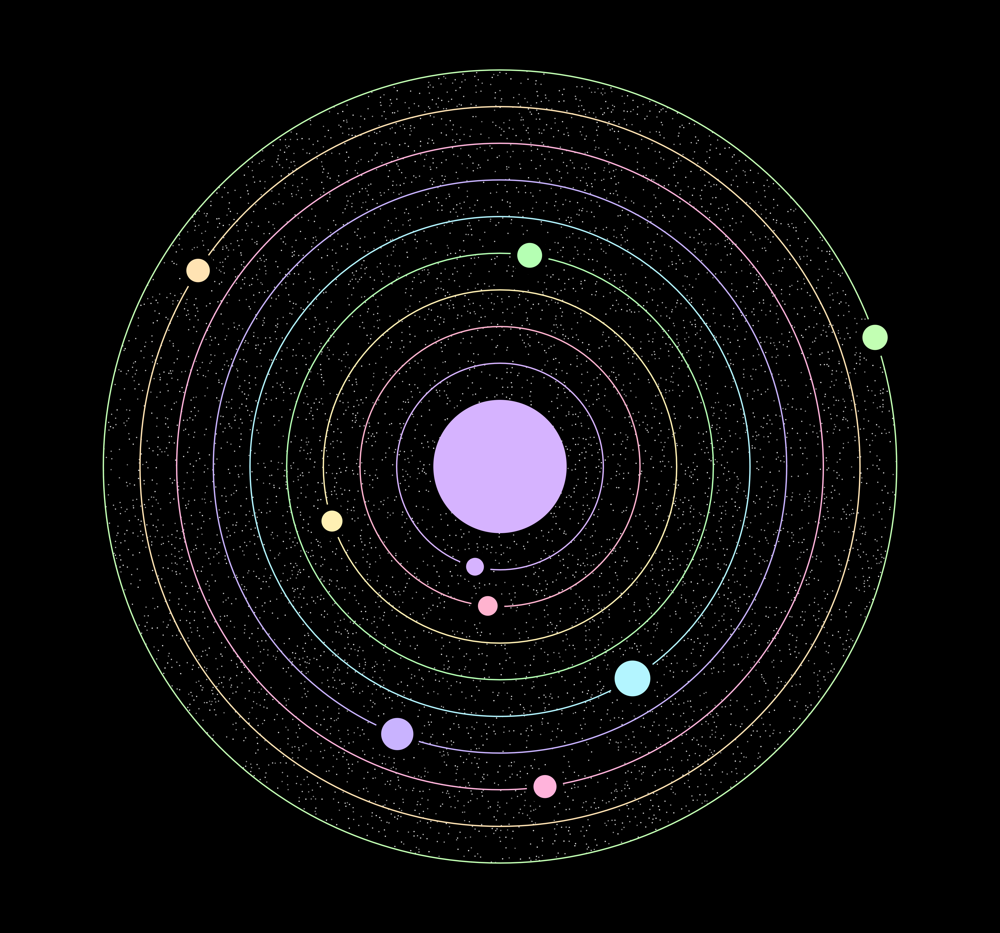

# Generative Orbit

Another attempt at a cool looking solar system generation, this time with some low saturation colors and simple star packing within the largest orbit.

- [Interactive Tool](https://www.erdavids.com/generative-orbit/)

Other links:
- [More Generative Art](https://github.com/erdavids/Generative-Art)
- [YouTube Channel](https://www.youtube.com/channel/UCUrmX3SvpPerq-KAfGBrgGQ)

All of these projects are available with the intention that other people will enjoy and learn from them. 

## Examples:

