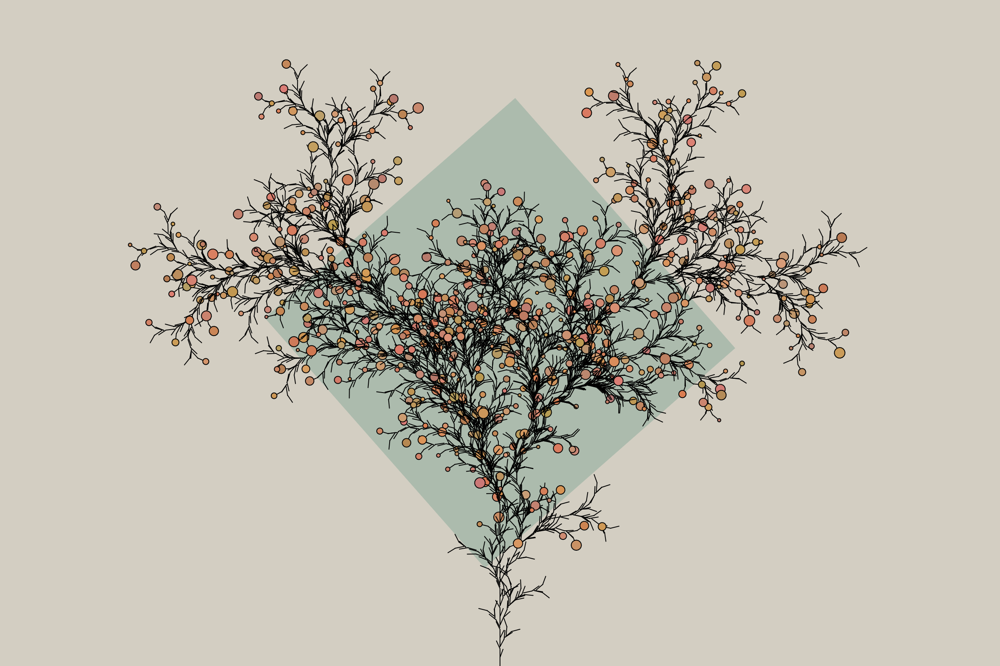

# Generative Plants

I've become really interested in l-systems and wanted to make something that allowed people to play around with different rulesets.

- [Interactive Tool](https://www.erdavids.com/generative-plants/)

Other links:
- [More Generative Art](https://github.com/erdavids/Generative-Art)
- [YouTube Channel](https://www.youtube.com/channel/UCUrmX3SvpPerq-KAfGBrgGQ)

All of these projects are available with the intention that other people will enjoy and learn from them. 

## Examples:

