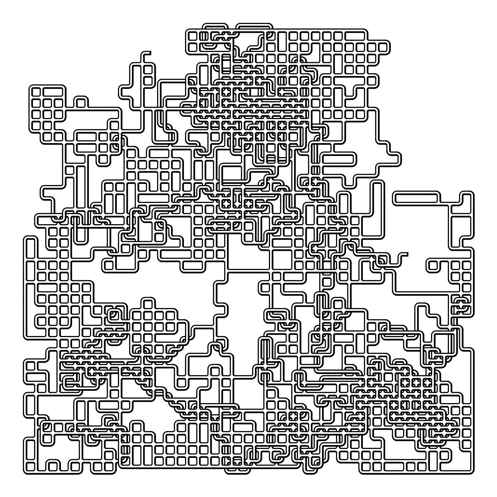
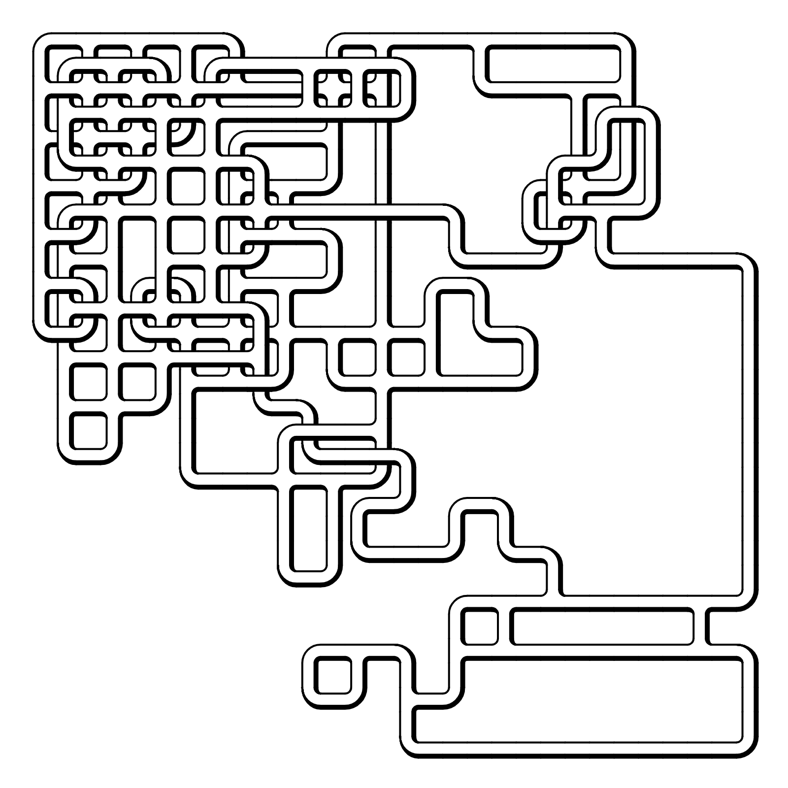

# Road Lattice

I wanted to work on a simple multi-leveled random walk grid thing, so I made this. Try playing around with some of the settings and see how it changes.

- [Interactive Tool](https://www.erdavids.com/road-lattice/)

Other links:
- [More Generative Art](https://github.com/erdavids/Generative-Art)
- [YouTube Channel](https://www.youtube.com/channel/UCUrmX3SvpPerq-KAfGBrgGQ)

All of these projects are available with the intention that other people will enjoy and learn from them. 

